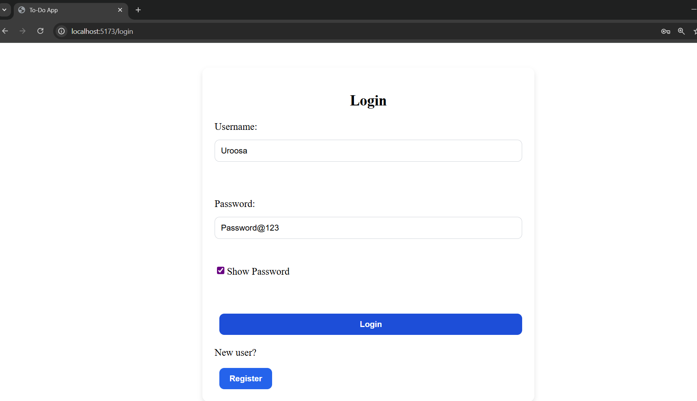
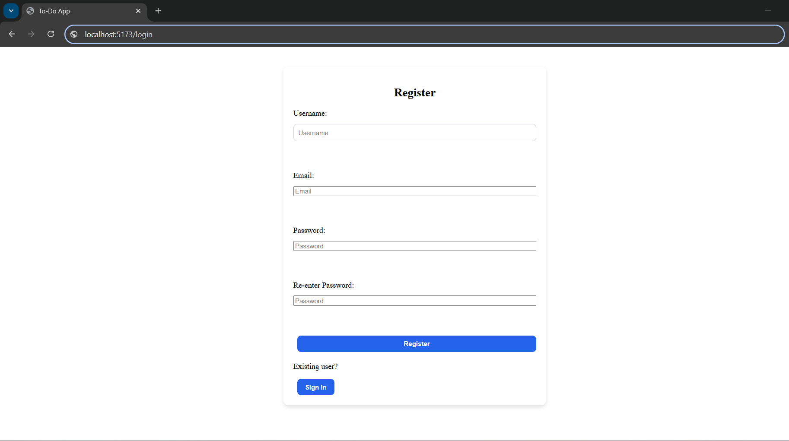
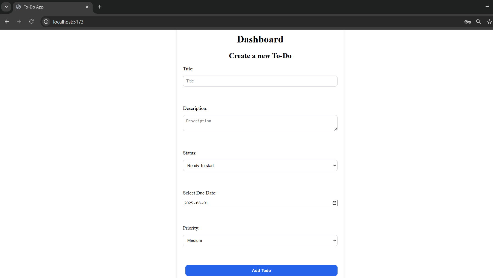
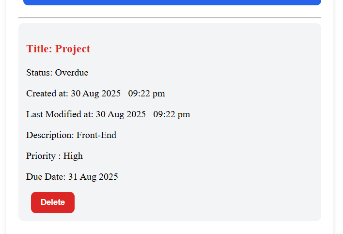
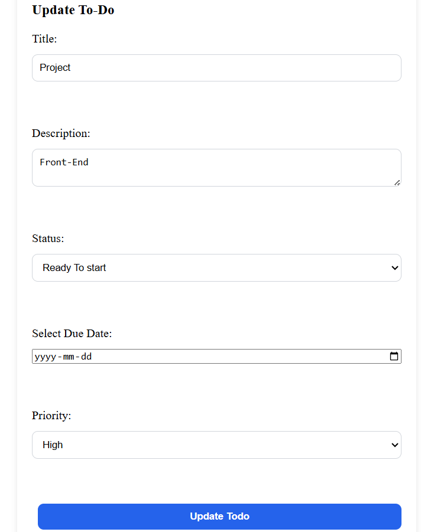

# 🌍React Frontend To-Do App ✅

A simple **To-Do List Web Application** built with **React**.  
Users can register, log in, and manage their tasks.

---

## 🚀 Features
- User Registration & Login
- Add, Edit, and Delete tasks
- Mark tasks as completed
- Responsive layout with plain CSS
- Clean project structure

---

## 🛠️ Tech Stack
- [React](https://react.dev/)
- JavaScript (ES6+)
- Plain CSS

---

## 📂 Project Structure

todo-frontend/
│
│── src/
│   ├── api/
│   │   └── api.jsx              # Axios instance with baseURL & CORS support
│   │
│   ├── components/
│   │   ├── ToDoList.jsx        # List of all todos
│   │   ├── ToDoItem.jsx        # Single todo row
│   │   ├── AddToDoForm.jsx     # Add new todo form
|   |   ├── UpdateToDoForm.jsx  # Update existing todo form
│   │   ├── RegisterForm.jsx    # Register new user
│   │   └── LoginForm.jsx       # Login user
│   │
│   ├── pages/
│   │   ├── Home.jsx            # Main dashboard (todo list + form)
│   │   ├── Register.jsx        # Register page
│   │   └── Login.jsx           # Login page
│   │
│   ├── context/
│   │   └── AuthContext.jsx     # Creates an empty context that contains state
|   |   └── AuthProvider.jsx    # Uses the context to handle auth state globally
|   |   └── useAuth.jsx         # Custom hook to access auth operations - register, login, logout
│   │
│   ├── utils/
│   │   └── PrivateRoute.jsx    # Wrapper for routes that require authentication
│   │
│   ├── App.jsx                 # Main app routes
│   ├── index.js                # Entry point
│   ├── styles.css              # Basic styling
│
├── package.json
├── README.md
└── vite.config.js 


---

## ⚙️ Installation & Setup

1. Clone the repository: go to the frontend folder and in the command-line execute the following commands:

   ```bash
   git clone https://github.com/UroosaMuheet/to-do-app.git
   cd to-do-app
   cd frontend
   npm install
   npm run dev

## 📸 Screenshots

Login Page


Register Page


To-Do List Page
- Add new To Do Item


- View existing To Dos


- Update To Do

